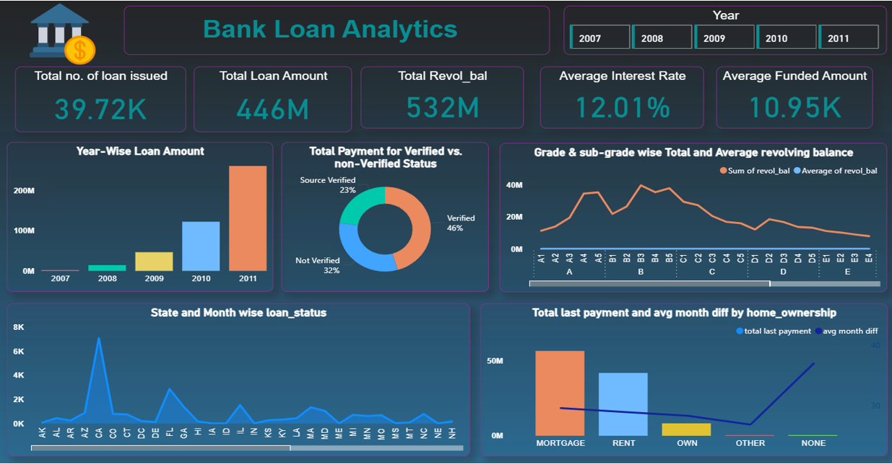
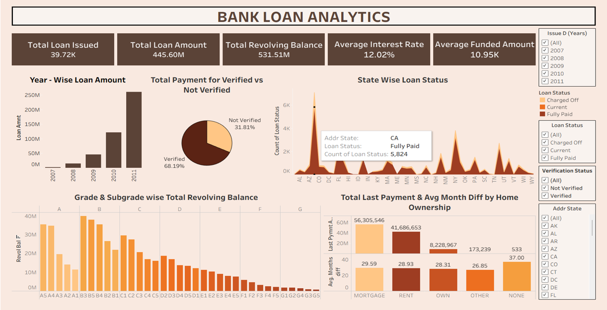
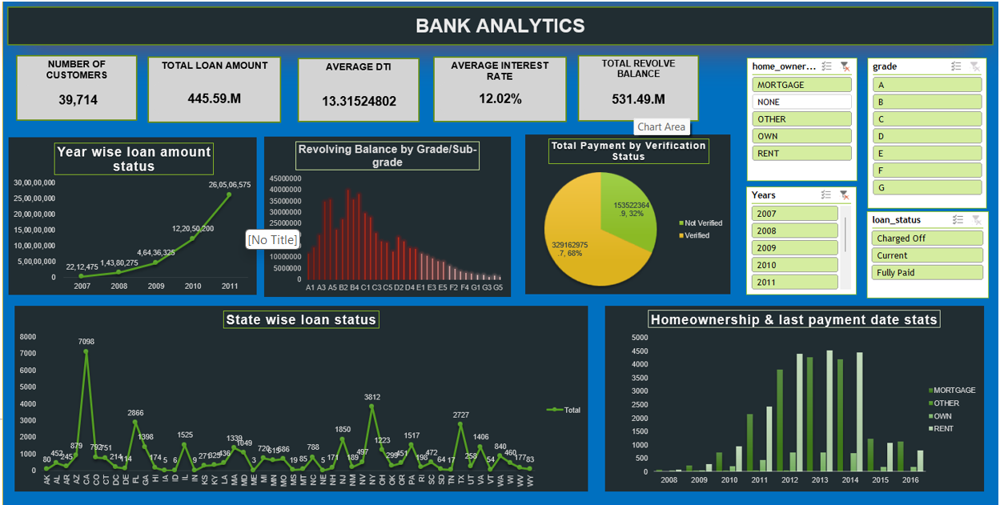

# Bank_Analytics

A comprehensive **Bank Analytics Project** designed to analyze loan-related datasets and derive meaningful insights using **Power BI, SQL, Excel, and Tableau**.
This project focuses on improving financial decision-making by identifying patterns in loan approval, default rates, customer segmentation, and overall bank performance.

---

## 🗂 Project Files Included

| File                           | Description                                       |
| ------------------------------ | ------------------------------------------------- |
| **Assets**                     | Dashboard Images (screen shots)                  |
| **Bank_Analytics.pbix**        | Power BI dashboard project file                   |
| **Bank_Analytics.xlsx**        | Preprocessed dataset used for analysis            |
| **Bank_Analytics.sql**         | SQL scripts used for data extraction & analysis   |
| **Bank_Analytics.pptx**        | Project presentation with insights & outcomes     |
| **Bank_Analytics.twbx**        | Tableau packaged workbook (Interactive dashboard) |

---

## 🔍 Project Overview

This project demonstrates a complete bank analytics workflow:

1. **Data Cleaning & Preparation** – handled using Excel & SQL
2. **Exploratory Data Analysis** – finding trends in loans, customer income, defaults etc.
3. **Dashboard Development**
   * 📈 Excel Dashboard
   * 📈 Power BI Dashboard
   * 📊 Tableau Dashboard
4. **Insights & Visualization** – communicated through interactive dashboards & PPT

---

## 🏦 Key Insights Derived

* Loan performance trends over time
* Default rate comparison across customer segments
* Income vs Loan amount relationship
* Distribution of loan statuses
* KPI indicators for business overview

---

## 🔧 Tech Stack Used

| Tool         | Purpose                                |
| ------------ | -------------------------------------- |
| **Power BI** | Main BI dashboard & data visualization |
| **Tableau**  | Additional insights & visualization    |
| **SQL**      | Querying & feature extraction          |
| **Excel**    | Data preprocessing & cleaning          |

---


## 📸 Dashboard Previews

### Power BI Dashboard


### Tableau Dashboard


### Excel Dashboard


---

## 🚀 How to Use

1. Clone or download this repository
2. Open datasets for exploration
3. Run SQL scripts in any SQL environment
4. Use `.pbix` or `.twbx` file to view dashboards
5. Check the presentation file for insights & summary

```bash
git clone https://github.com/<Shashank21397>/Bank_Analytics.git
```

---

## 📁 Folder Structure

```
Bank_Analytics/
│── Assets
│── Bank_Analytics.pbix
│── Bank_Analytics.xlsx
│── Bank_Analytics.sql
│── Bank_Analytics.twbx
│── Bank_Analytics.pptx
└── README.md
```

---

## ✨ Future Improvements

* Add Power BI Tableau integration comparison
* Deploy dashboard online for live accessibility
* Add machine learning loan default prediction model

---


